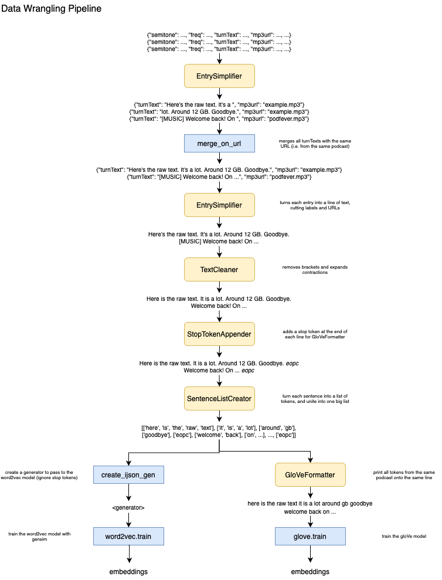

# Welcome to my Bachelor's Thesis Repository! 

My thesis is titled "Uncovering and Mitigating Sociocultural Bias in Public Discourse Datasets" and is supervised by Alexander Hoyle and Ryan Cotterell. The goal is twofold: First, I investigate a fairly new podcast dataset, training both word2vec and gloVe models on it and evaluating the resulting embeddings' performance and bias. Second, I'll implement debiasing algorithms like Hard-Debias and INLP, run them on the embeddings, and compare results. 

The podcast dataset is from [Litterer et al.'s *Mapping the Podcast Ecosystem with the Structured Podcast Research Corpus* (2024)](https://arxiv.org/pdf/2411.07892).

## Project Hierarchy

This repository is split into five folders, each representing a different stage of the project. 

### wrangling

This folder contains all code used in data preprocessing, i.e. turning the raw podcast dataset into formats accepted by the word2vec and gloVe models. I've organised most of the code into classes.

```filefinder.py``` contains a **FileFinder** class. As the name suggests, instances of this class find all files in a given directory that match chosen criteria. 

```fileproc.py``` contains the **FileProcessor** class. This class takes a list of input files, a destination directory, and a **FileFunction** (see next paragraph), and transforms all input files using that function, saving the output in the destination directory. 

```filefunc.py``` contains a parent class, **FileFunction**, and many subclasses that achieve different functionalities. A **FileFunction**, most generally, takes an input file path and an output file path and transforms input to output using its ```map()``` function. As of yet, I've implemented five subclasses: 

- ```EntrySimplifier``` takes a JSONL as input and gets rid of some of its fields, returning either an updated JSONL or a text file. One can choose to omit labels in the output.
- ```TextCleaner``` takes a text file and can remove bracketed content, as well as expand contractions with different degrees of intelligence. Please note that I haven't been able to get ```pycontractions``` running on my computer, so only ```contraction_level = 1``` works. 
- ```StopTokenAppender``` appends a custom stop token to the end of each line in a text file (default: ```epoc``` for *end of podcast*). See [design choices](#design-choices).
- ```SentenceListCreator``` takes a text file and creates a list of tokens for each sentence therein, combining these lists to one big list. This is required for word2vec training. 
- ```GloVeFormatter``` takes the list output by ```SentenceListCreator```, and returns a text file in GloVe input format. See [design choices](#design-choices). 

Other methods in this folder include ```merge_on_url``` and ```create_ijson_gen```. ```testing.py``` contains some of the tests I've used. See the diagram for explanations. 

To help give an overview of the wrangling pipeline, here's a visual diagram: 



Subclasses of ```FileFunction``` are in yellow, while other methods are colored blue. 

#### Design Choices

Devising this pipeline took a while. I originally just wrote a method for every type of entry simplification and my own tokenizer, but after writing many methods with the same prelude, I decided to revamp the whole thing and create the abstract classes ```FileFinder```, ```FileProcessor``` and ```FileFunction```. It took quite some time, but it has paid off, as now whenever you need new file-to-file functionality you can just create a new subclass of ```FileFinder``` and change its ```map``` function.

Some other design decisions: 

- **Merging ```turnText``` on URL data:** This turned out to be the most reliable way to combine text segments into meaningful groups. My first idea was to merge on speaker data, but some JSONL entries spanned multiple speakers, with no indication as to when they switched. Merging on URL splits the text into podcast episodes, which (I feel) is a reasonable context-based split.
- **Removing brackets:** Podcasts often include music and jingles, and the paper's authors represent these with brackets, e.g. *[MUSIC]*, *(upbeat music)*. As these labels don't necessarily align with their surrounding context, they needed to be filtered out. ```TextCleaner``` does this, but only for pairs of brackets, ignoring open-ended ones. Music labels weren't always perfect (e.g. *[MUSIC*, *upbeat music)*) but simple testing showed that malformed ones were rare. So I've left them in.
- **Expanding contractions:** My own tokenizer was rudimentary and just got rid of apostrophes (*it's* -> *its*). ```spaCy```'s tokenizer recognizes contractions and plainly gets rid of them (*it's* -> *it*). Alex explained how expanding contractions didn't really matter for the contractions' word representations, as they're numerous and we don't care about them that much. My current thinking is grammar-based: In a podcast dataset, we're analyzing spoken language, and everyone uses contractions. Thus, (maybe) for grammatical evaluation tasks, expanding contractions might give better performance. This may very well be a misguided view, so if you disagree, please reach out.
- **Appending stop tokens:** This resulted from not wanting to run the ```spaCy``` tokenizer twice. Tokenization is the computationally heaviest part of the wrangling pipeline, and although it might have been cleaner to run it twice, outputting a sentence list once and a text file in gloVe format the other time, I didn't have the patience to do so on my laptop. The stop tokens allow the ```GloVeFormatter``` to recognise when a podcast episode has finished and start a new line. This enables the gloVe model to reset its cooccurrence matrices with each new episode.

#### Extensions

Some things that could be extended upon in this section. 

- **Named Entity Recognition:** This could be done using ```spaCy``` here or ```gensim``` before word2vec model training. Doing it with ```gensim``` would create a discrepancy between models, as it doesn't accommodate gloVe. I've implemented a basic version of this in ```SentenceListCreator```, but haven't run it yet.
- **Parallelization:** Making the code run faster would be great. The code in this folder isn't parallelized, the only optimizations being generator-based. This would definitely be a good project for later, but right now, I want to get started with evaluation.

### embedding_gen

[to be started]

### eval

[to be started]

### debiasing

[to be started]

### extras 

[to be started]

